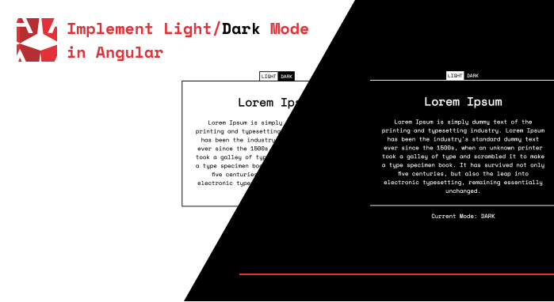

## Angular Light / Dark Mode

This project showcases Light / Dark mode implementation of a Angular Project.

## Features

- Mode Toggle Button
- Angular service that can be used to implement your own toggle component
- Persistence via Local Storage (ability to write other persistance methods - e.g Session Storage)
- Mode change listener based on Rxjs Observable
- SCSS support with CSS variables
- Require no additional libraries

## Local Setup

- Clone the project
- Install dependencies `npm install`
- Run `npm run start`
- Visit `http://localhost:4200/`

### Feedbacks are welcome!
